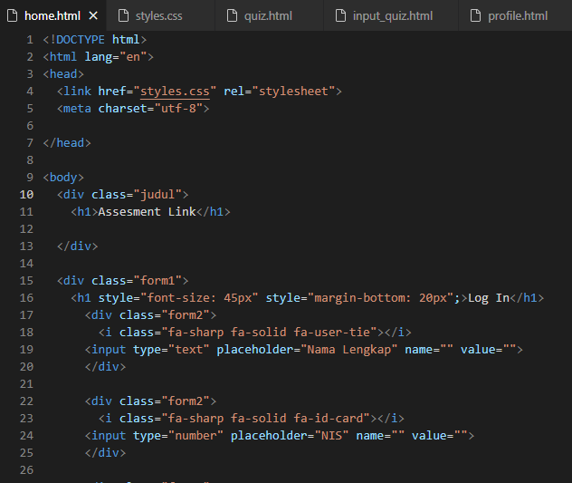
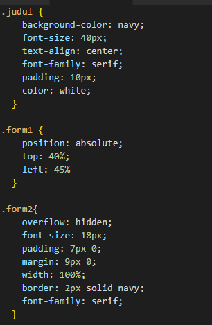
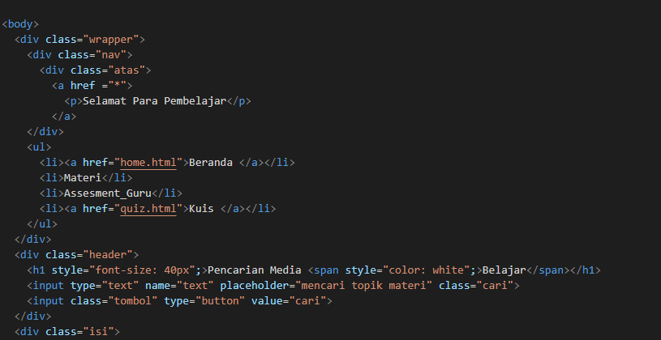
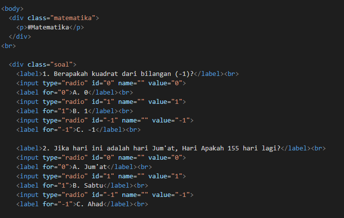
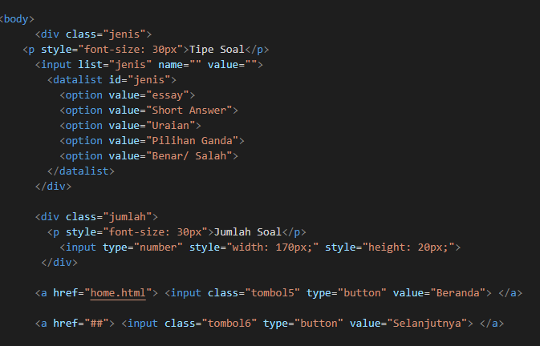
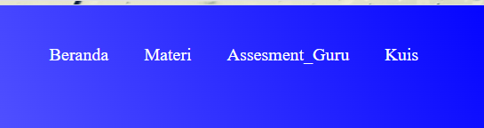
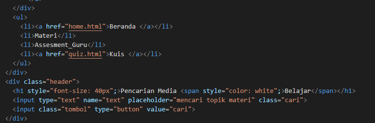

# AS-LINK_Design
What and Why AS-LINK ?

## Final Project Title (CS50 2023)
AS-LINK (Assesment Link)

## My Team
1. Yudha Agustama
2. Muchammad Syaifudin Zuhri

## Introduction
AS-LINK is an application in the form of a web page which is used as a medium for learning for students (_specifically_) and teachers (_generally_). This application contains several tabs to help students find their needs regarding learning media (Best Outcome) and practice questions in the form of quizzes (Good Outcome).

## Background
Students in today's generation are very close to IT media, regardless of how they use it, so it is the duty of parents including teachers to guide them to use IT wisely. Therefore, learning with the help or additional use of IT facilities is expected to make students more enthusiastic about learning. In addition, the use of IT media also indirectly trains teachers to learn. So the idea was born to create an IT-based application that became a learning tool for students as well as teachers, namely AS-LINK.

## Elements of Coding
* Html
* CSS

## Preparation Step
**home.html**

------------------------
**styles.css**

------------------------
**profile.html**

------------------------
**quiz.html**

------------------------
**input_quiz.html**

------------------------

## Next Step
1. Making login button @home.html
2. Making tab menu @profile.html
3. Making searching menu @profile.html
4. Making Quiz @quiz.html

------------------------------------------------------

------------------------------------------------------

